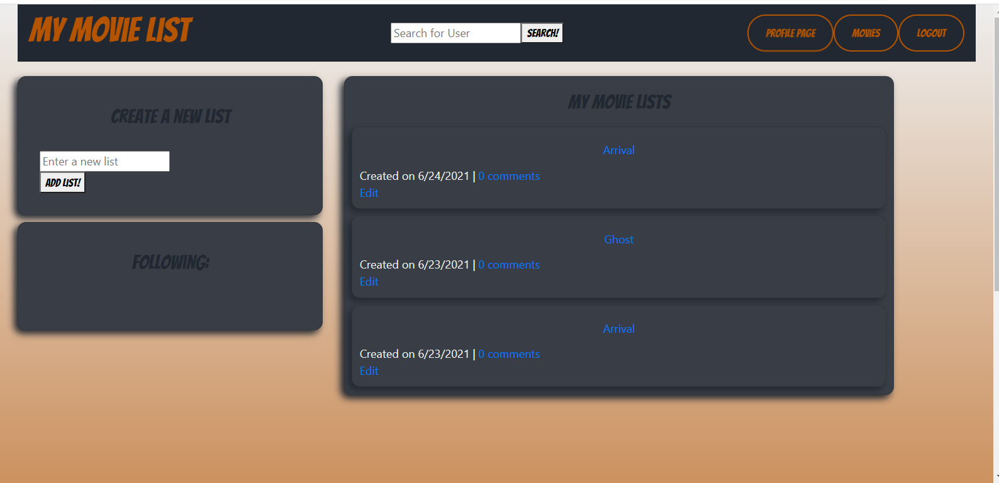
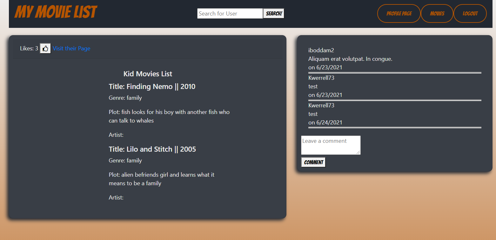

# myMovieList

## USER STORY
As a user, I want to be able to create, compare and like custom movie lists; made by multiple users, so that I can see what everyone has been watching during quarantine.

### Setup 
Clone the repo, navigate to the root folder,  run the following commands:
* Npm Install
* run schema in mySQL 
* NPM run seed
* go to localhost:3001
* NOTE  Deployed link below

#### Movie API
http://www.omdbapi.com/

The User can fetch a movie by title search.

### Built With
* www.omdbapi.com
* JavaScript
* Sequelize
* Node.js
* MySQL
* Express.js
* Handlebars
* CSS
* Bootstrap
* Heroku
* HTML
* bcrypt
* dotenv

### Link to walk thru video of app presentation
https://drive.google.com/file/d/1M-r_vRbuwJU7QjoXV_Mjj-nc4GrljMeK/view

## Screenshots of app

## Link to deployed application
*TBD* Heroku

## Contribution
Created by Joseph Bryant, Lily Hissong, Kellie Werrell, and Pablo De La Cruz  :star:

  
